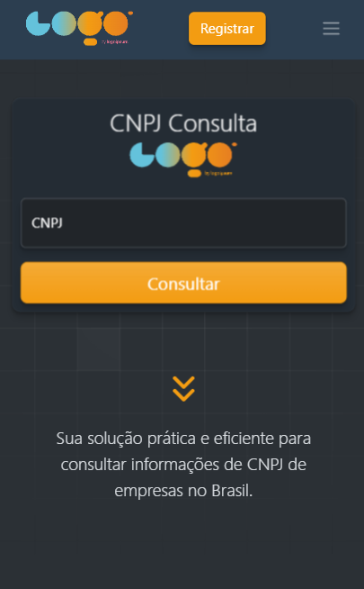
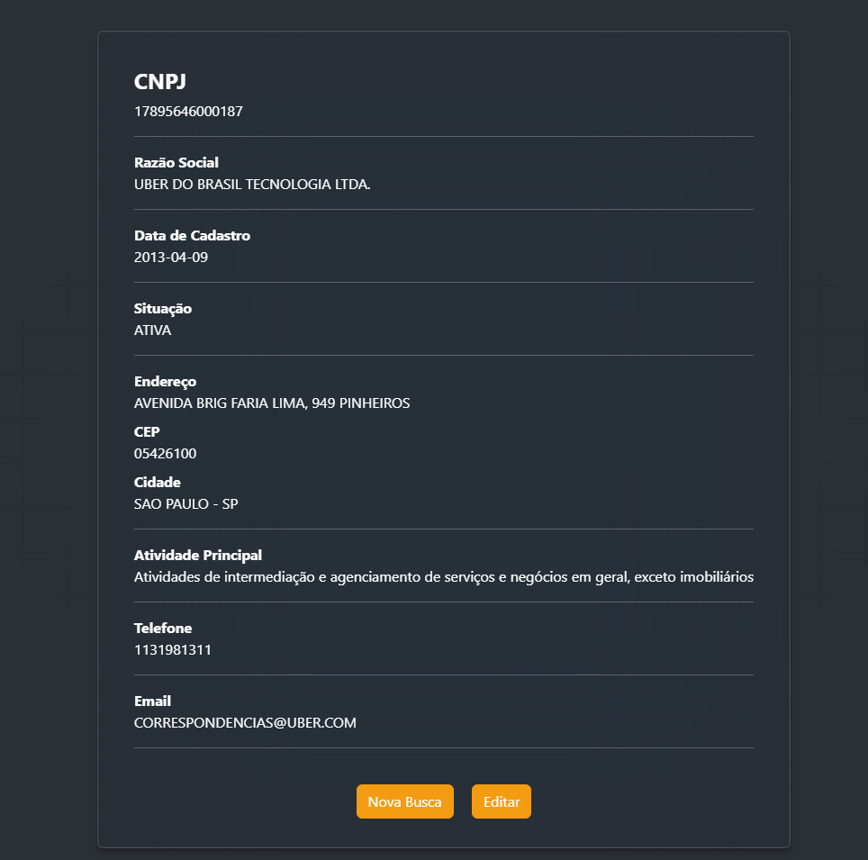

# Consulta CNPJ 🕵️‍♂️

Uma aplicação web simples para consultar informações de CNPJ utilizando a API da BrasilAPI.

## Índice

- [Visão Geral](#visão-geral)
- [Tecnologias Utilizadas](#Tecnologias-Utilizadas-🛠️)
- [Instalação](#Instalação-⚙️)
- [Uso](#Uso-🚀)
- [Contribuição](#Contribuição-🤝)
- [Licença](#Licença-📝)
- [Contato](#Contato-📧)

## Visão Geral

Este projeto permite aos usuários consultar informações detalhadas sobre um CNPJ (Cadastro Nacional da Pessoa Jurídica) no Brasil. A aplicação faz uso da API da BrasilAPI para obter os dados e exibi-los de maneira organizada e fácil de entender. 

- [Inputmask](https://github.com/RobinHerbots/Inputmask)
- [BrasilAPI](https://brasilapi.com.br/)

### Imagens do Projeto

<div style="display: flex; gap: 10px;">

  
  
  

</div>


## Tecnologias Utilizadas 🛠️

- 
- 
- 
- 
- 

## Instalação ⚙️

1. Clone o repositório para o seu ambiente local:

   ```bash
   git clone https://github.com/bruno167/consulta-cnpj.git
   ```

2. Navegue até o diretório do projeto:

   ```bash
   cd consulta-cnpj
   ```

3. Abra o arquivo `index.html` no seu navegador preferido.

## Uso 🚀

1. Insira um número de CNPJ válido no campo de entrada.
2. Clique no botão "Consultar".
3. Aguarde enquanto os dados são buscados e exibidos na página.

## Funcionalidades ✨

- Máscara de entrada para formatação correta do CNPJ.
- Consulta de CNPJ utilizando a API da BrasilAPI.
- Exibição de informações detalhadas sobre o CNPJ.

## Contribuição 🤝

Se você deseja contribuir para este projeto, siga os passos abaixo:

1. Faça um fork do repositório.
2. Crie uma nova branch para a sua feature (`git checkout -b feature/nova-feature`).
3. Faça commit das suas alterações (`git commit -m 'Adiciona nova feature'`).
4. Faça push para a branch (`git push origin feature/nova-feature`).
5. Abra um Pull Request.

## Licença 📝

Este projeto está licenciado sob a Licença MIT. Veja o arquivo [LICENSE](License) para mais detalhes.

## Contato 📧

Bruno - [brunoa0504@gmail.com](mailto:brunoa0504@gmail.com)

Projeto Link: [https://github.com/bruno167/consulta-cnpj](https://github.com/bruno167/consulta-cnpj)
